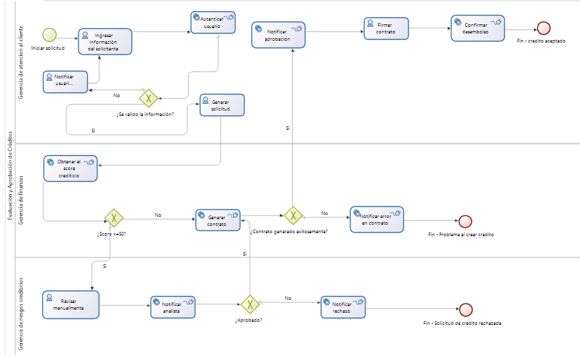
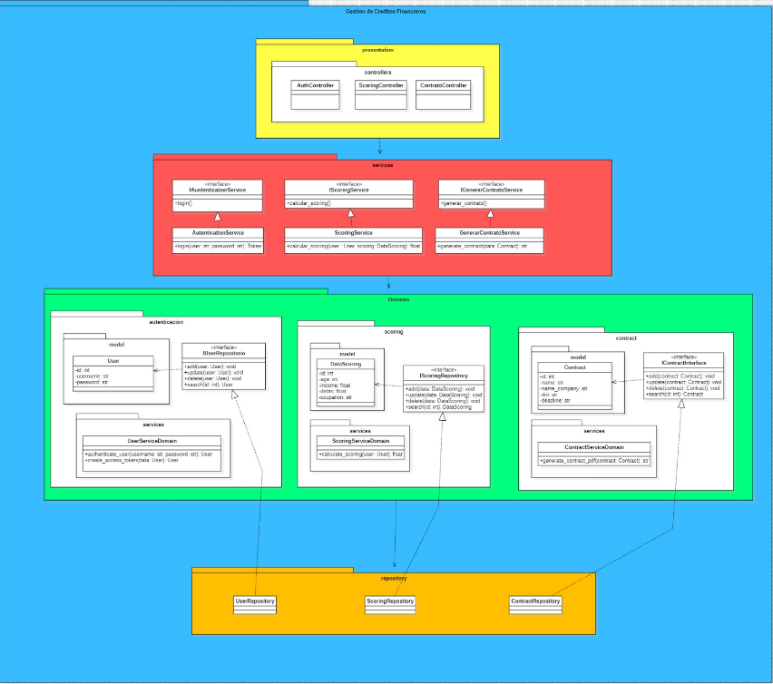

# 1. Descripción
- Nombre del Equipo: Jhosep
- Integrantes:
Cacsire Sanchez, Jhosep Angel
- Cliente
Organización: Banco de credito del Peru
# 2.Propodito del proyecto
El propósito de este proyecto es simular y replicar el proceso de solicitud de préstamo del Banco de Crédito del Perú (BCP) utilizando una arquitectura basada en microservicios. A través del modelado BPMN y la integración de diversas herramientas como BonitaSoft, Postman y FakeSMTP, se busca representar de manera realista el flujo completo del préstamo: desde la solicitud del cliente hasta la evaluación, aprobación y notificación del resultado.
Este proyecto tiene como objetivo principal demostrar cómo se puede automatizar un proceso bancario real utilizando tecnologías modernas, promoviendo buenas prácticas en integración de servicios, orquestación de procesos y pruebas automatizadas.
# 3.Visión General: Aplicación BPM (Application Page + Menú)
La aplicación BPM desarrollada con BonitaSoft representa el proceso completo de solicitud de préstamo del banco BCP, modelado mediante un diagrama BPMN. La interfaz está diseñada para facilitar la interacción de los distintos actores del proceso según su rol, desde el cliente hasta el área de créditos.

A continuación se muestra el diagrama BPMN que describe el flujo del proceso:

## Componentes principales del menú:
- Inicio / Home: Página de entrada al portal BPM.

- Solicitar Préstamo: Formulario inicial donde el cliente ingresa su información personal.

- Validación de Información: Validación automatizada del formulario.

- Autenticación: Confirmación del usuario.

- Evaluación Crediticia: Obtención del score y análisis automatizado o manual según el resultado.

- Generación de Contrato: Creación del contrato en caso de aprobación.

- Notificación: Se notifican los resultados al usuario (aprobación o rechazo).

- Confirmación de Desembolso: Finalización del proceso en caso de éxito.

Esta estructura permite simular el funcionamiento real de la entidad financiera, dividiendo claramente las responsabilidades por áreas y conectando las tareas mediante eventos automáticos, formularios y decisiones condicionales.

# Procesos de Negocio: Breve Descripción y Proceso

Este proyecto modela el proceso de **solicitud de préstamo** replicando el flujo de atención del Banco de Crédito del Perú (BCP), utilizando BonitaSoft como motor BPM. El flujo fue diseñado en base a buenas prácticas de orquestación de procesos y arquitectura basada en microservicios.

## Descripción General

El proceso abarca todas las etapas que un cliente atraviesa al solicitar un crédito, desde la solicitud inicial hasta la confirmación o rechazo del desembolso. Se han definido varios subprocesos y decisiones automáticas, dividiendo la lógica de negocio entre distintas áreas responsables.

## Etapas del Proceso

1. **Inicio del proceso**
   - El cliente inicia la solicitud desde la aplicación BPM.

2. **Ingreso y validación de datos**
   - El usuario completa un formulario con su información personal y financiera.
   - El sistema valida que los datos ingresados sean correctos.

3. **Autenticación del solicitante**
   - Se verifica la identidad del solicitante mediante autenticación básica (simulada).

4. **Generación de solicitud**
   - Se crea un registro formal de la solicitud y se continúa con el análisis.

5. **Evaluación crediticia**
   - Se obtiene el *score* crediticio del solicitante.
   - Si el *score* es menor o igual a 50, se deriva a revisión manual.
   - Si es mayor a 50, se intenta generar el contrato automáticamente.

6. **Revisión manual (si aplica)**
   - Un analista de crédito revisa los casos de *score* bajo y aprueba o rechaza.

7. **Generación de contrato**
   - Si todo está correcto, se genera el contrato de préstamo.

8. **Notificaciones**
   - El sistema notifica automáticamente al usuario si el crédito fue aprobado, rechazado o si ocurrió un error.

9. **Firma y desembolso**
   - En caso de aprobación, el usuario firma y se confirma el desembolso del crédito.

---

## Actores Involucrados

| Actor                        | Rol en el proceso                          |
|-----------------------------|--------------------------------------------|
| Solicitante (Cliente)       | Inicia la solicitud y firma el contrato    |
| Sistema BPM                 | Automatiza tareas, evalúa condiciones      |
| Analista de crédito         | Revisa manualmente casos de score bajo     |
| Área de Finanzas            | Confirma la aprobación y desembolso        |

---

## Diagrama BPMN del Proceso

# Principales Servicios REST

- **Módulo: Autenticación**  
  `POST /token` – Obtener token JWT  
  **Parámetros:** `username`, `password`

- **Módulo: Scoring**  
  `POST /score` – Calcular score de cliente  
  **Parámetros:** JSON con `nombre`, `dni`, `ingresos_mensuales`

- **Módulo: Contratos**  
  `POST /generar-contrato` – Genera PDF del contrato  
  **Parámetros:** JSON con `parte_a`, `parte_b`, `dni`, `fecha`, `contenido[]`

📁 [Repositorio con archivo OpenAPI](openapi.yaml)
# Microservicios

